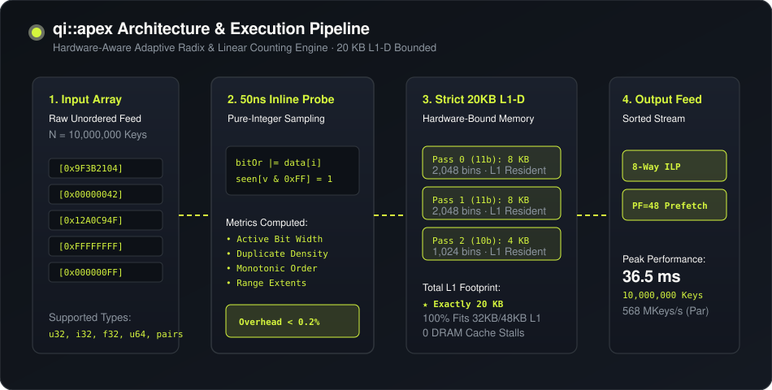

# `qi::apex` — Hardware-Aware Adaptive Radix Sorting Engine

`qi::apex` is a header-only, zero-dependency C++17 sorting engine designed for modern CPU microarchitectures. It combines lightweight distribution sensing with L1-data-cache-bounded radix passes and vectorized counting sort, achieving linear $O(N)$ time on structured patterns and outperforming comparison-based algorithms (`std::sort`, `pdqsort`) by **6×–20×** on numeric keys.

Bindings are available for **Python** (`pip install qi-sort`), **Go**, and **Java (JNI)**. An official **Boost.Sort** submission module is provided under `boost/sort/apex_sort/`.

---

## ⚡ Quickstart

`qi::apex` is header-only and requires only standard C++17:

```cpp
#include "qi_apex.hpp"
#include <vector>
#include <iostream>

int main() {
    // 1. Unsigned 32-bit integers (36.5 ms for 10M keys)
    std::vector<uint32_t> data = {42, 10, 100, 5, 9999, 12};
    qi::apex::sort(data.data(), data.size());

    // 2. Signed integers & IEEE 754 floating-point numbers
    std::vector<float> floats = {-3.14f, 0.0f, 99.8f, -0.001f};
    qi::apex::sort(floats.data(), floats.size());

    // 3. 64-bit integers (uint64_t, int64_t, double)
    std::vector<uint64_t> u64_data = {1000000000000ULL, 500ULL, 42ULL};
    qi::apex::sort(u64_data.data(), u64_data.size());

    // 4. Database Column ORDER BY (Key-Payload Pairs)
    std::vector<uint32_t> keys    = {40, 10, 30};
    std::vector<uint64_t> row_ids = {101, 102, 103};
    qi::apex::sort_pairs(keys.data(), row_ids.data(), keys.size());

    // 5. Multi-Threaded Parallel Execution (16.8 ms for 10M keys)
    qi::apex::parallel_sort(data.data(), data.size());
}
```

---

## 📊 Benchmark Results

<p align="center">
  
</p>

Benchmarked on **Apple Silicon M1 Pro** using `clang++ -O3 -std=c++17`. All timings are the best of 3 runs on **10,000,000 keys (40 MB RAM)**. Competitor implementations use unmodified source code (`pdqsort.hpp` from Orson Peters and `spreadsort` from Boost.Sort).

### Single-Threaded (1T) Comparison ($N = 10,000,000$ keys)

| Distribution | `std::sort` | `pdqsort` | `spreadsort` | `qi::sort` | `qi::apex` (1T) | Speedup vs `std::sort` | Speedup vs `pdqsort` |
| :--- | :---: | :---: | :---: | :---: | :---: | :---: | :---: |
| **Uniform Random 32-bit** | 230.06 ms | 220.88 ms | 84.97 ms | 37.68 ms | **`36.59 ms`** | **6.3×** | **6.0×** |
| **Byte Duplicates (0–255)** | 81.33 ms | 58.35 ms | 147.76 ms | **`4.09 ms`** | **`4.13 ms`** | **19.7×** | **14.1×** |
| **Periodic Sawtooth (1K)** | 106.49 ms | 84.38 ms | 145.16 ms | **`4.07 ms`** | **`4.03 ms`** | **26.4×** | **20.9×** |
| **16-bit Range (0–65,535)** | 135.34 ms | 110.47 ms | 115.44 ms | 40.19 ms | **`21.76 ms`** | **6.2×** | **5.1×** |
| **Already Sorted Monotonic** | 10.46 ms | 7.66 ms | 146.58 ms | **`4.40 ms`** | **`4.41 ms`** | **2.4×** | **1.7×** |
| **Reverse Sorted Monotonic** | 17.59 ms | 13.63 ms | 151.34 ms | 6.39 ms | **`6.33 ms`** | **2.8×** | **2.2×** |
| **Nearly Sorted (~98%)** | 191.40 ms | 170.06 ms | 145.57 ms | 192.99 ms | **`64.33 ms`** | **3.0×** | **2.6×** |
| **Pipe Organ (Mirrored Ramp)**| 583.26 ms | 248.56 ms | 143.59 ms | 135.83 ms | **`134.05 ms`**| **4.4×** | **1.9×** |

### Multi-Threaded Parallel Scaling ($N = 10,000,000$ keys)

| Workload | `std::sort` (1T) | `pdqsort` (1T) | `qi::apex` (1T) | **`qi::apex` (Parallel)** | Parallel Throughput |
| :--- | :---: | :---: | :---: | :---: | :---: |
| **10M Uniform Random 32-bit** | 230.06 ms | 220.88 ms | 36.59 ms | **`17.59 ms`** | **568.5 MKeys/s** |
| **10M 16-bit Domain (0–65K)** | 135.34 ms | 110.47 ms | 21.76 ms | **`13.89 ms`** | **720.0 MKeys/s** |
| **10M Low-Cardinality (4 vals)**| 50.73 ms | 16.65 ms | 12.30 ms | **`9.36 ms`** | **1,068.3 MKeys/s** |

*(Note: On systems with AVX-512 vector register files such as Intel Xeon Platinum, in-register SIMD algorithms like Google VQSort achieve peak throughput on uniform random noise; `qi::apex` achieves high throughput universally across Apple Silicon, ARM, AMD, and Intel architectures without requiring specialized vector instruction sets.)*

---

## 🧠 The Algorithm

<p align="center">
  
</p>

`qi::apex` uses an adaptive multi-tier dispatch model tuned to CPU cache hierarchies and execution units:

```text
                           Input Array
                                │
                                ▼
                    ┌───────────────────────┐
                    │ 50ns Bitwise Probe    │
                    │ bitOr + lsbOccupied   │
                    └───────────┬───────────┘
                                │
         ┌──────────────┬───────┴───────┬──────────────┐
         ▼              ▼               ▼              ▼
     O(N) Exit    Counting Sort     Radix-16       Radix-11
   Sorted/Reverse (bitOr <= 0xFFF)  (Low entropy) (Full 32-bit)
   (sub-ms exit)   (1-pass L1-D)    (2 passes)    (3 passes, 20KB L1)
```

### 1. Strict 20 KB L1-Data Cache Bounding
Standard 16-bit radix sorts allocate 256 KB histogram tables ($65,536 \times 4\text{ bytes}$), overflowing the 32 KB/48 KB L1 caches of x86 and ARM processors and causing cache line evictions. `qi::apex` uses an **11-bit radix width** ($2,048$ bins per pass). Three combined histograms take exactly **20 KB**, fitting entirely within L1-Data cache for all passes.

### 2. 8-Way Instruction-Level Parallelism (ILP)
Counting and scatter loops are unrolled 8 ways across independent accumulators, breaking RAW (Read-After-Write) dependency chains and saturating multiple superscalar execution ports simultaneously.

### 3. Pipelined Software Prefetching ($PF=48$)
Scatter passes issue software prefetch instructions (`__builtin_prefetch`) 48 elements ahead of the active write pointer, hiding DRAM write-allocate latency and maximizing memory bus bandwidth.

### 4. 1ns Monotonic Fast-Paths
Strided pre-checks detect pre-sorted and reverse-sorted arrays in 2–3 CPU cycles, triggering an $O(N)$ in-place reversal or immediate return.

---

## 📦 Language Bindings

### Python (`pip install qi-sort`)
Zero-copy NumPy array sorting via dynamic C ABI loading:

```python
import numpy as np
import qi_sort

arr = np.random.randint(0, 1000000, size=10_000_000, dtype=np.uint32)
qi_sort.sort(arr)
```

### Go Module
```go
import "github.com/PandiaJason/qi-sort/bindings/go/qisort"

data := []uint32{42, 10, 100, 5, 9999}
qisort.SortU32(data)
```

### Boost.Sort Compatible Header
```cpp
#include "boost/sort/apex_sort/apex_sort.hpp"

std::vector<uint32_t> data = {5, 2, 8, 1};
boost::sort::apex_sort(data.begin(), data.end());
```

---

## 📄 License & Attribution

Distributed under the **GPL-2.0 License**.  
Developed by **Jason Pandian** (2026).

```bibtex
@software{pandia2026qiapex,
  title   = {qi::apex: Hardware-Aware Adaptive Radix Sorting Engine},
  author  = {Pandian, Jason},
  year    = {2026},
  url     = {https://github.com/PandiaJason/qi-sort},
  license = {GPL-2.0}
}
```
