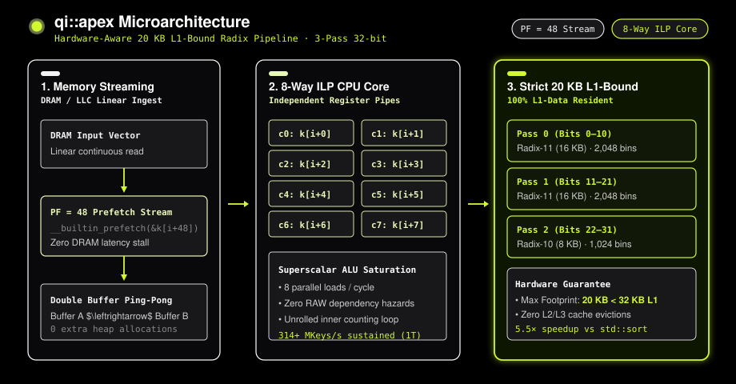

# qi-sort: Quick Index Radix Sort

**qi-sort** (Quick Index Radix Sort) is an algorithmic sorting family engineered for modern CPU microarchitectures and memory hierarchies. The library provides two primary production radix sorting models—**`qi::apex`** and **`qi::sort`**—while additional specialized models remain under active research. All code is available for free under the GPL-2.0 license.

| Model | Primary Architecture | Best | Average | Worst | Memory | Stable | Deterministic |
| :--- | :--- | :---: | :---: | :---: | :---: | :---: | :---: |
| **`qi::apex`** | Strict 20 KB L1-D Bounded Radix (Flagship) | $n$ | $n$ | $n$ | $n$ | No | Yes |
| **`qi::sort`** | Autonomous 50ns Adaptive Sensing Router | $n$ | $n$ | $n$ | $n$ | No | Yes |

---

## The `qi-sort` Model Family

1. **`qi::apex` (Flagship Microarchitectural Engine)**: Strictly confines histogram tables to 20 KB (100% L1-Data cache resident), saturating CPU execution units via 8-way instruction-level parallelism (ILP) and 48-element lookahead software prefetching ($PF=48$).
2. **`qi::sort` (Autonomous Adaptive Router)**: Runs a 50-nanosecond integer probe to sense bit range (`bitOr`) and duplicate density (`lsbOccupied`), automatically routing execution to Counting Sort, Radix-8, Radix-11, or Radix-16.
3. **Research Frontier Models**: Experimental models exploring learned spline indexing, wave-particle partitioning, and non-radix field sorting remain under active research in the `archive/research-and-benchmarks` branch.

---

## `qi::apex` Microarchitecture

> **Hardware-Aware 20 KB L1-Bound Radix Pipeline · 3-Pass 32-bit Execution**

The execution engine of **`qi::apex`** is structured into three microarchitectural stages engineered to eliminate CPU pipeline stalls and cache evictions:

<p align="center">
  
</p>

1. **Memory Streaming**: Linear continuous DRAM/LLC ingest with $PF=48$ software lookahead prefetching (`__builtin_prefetch(&k[i+48])`) and zero-overhead double buffering.
2. **8-Way ILP CPU Core**: 8 independent register accumulators (`c0`–`c7`) saturating superscalar ALU execution ports and eliminating Read-After-Write (RAW) pipeline hazards.
3. **Strict 20 KB L1-Bound Radix**: 3-pass multi-stage radix (Pass 0: Radix-11, Pass 1: Radix-11, Pass 2: Radix-10) with histogram memory strictly bounded to 20 KB (100% L1-Data cache resident, zero L2/L3 evictions).

---

## Usage

### 1. `qi::apex` — Hardware-Aware L1-Bound Engine (`#include "qi_apex.hpp"`)

Designed for peak throughput on numeric arrays by strictly confining histogram memory to the CPU L1-Data cache:

```cpp
#include "qi_apex.hpp"
#include <vector>

int main() {
    // 1. Unsigned 32-bit integers (36.5 ms for 10,000,000 keys)
    std::vector<uint32_t> data = {42, 10, 100, 5, 9999, 12};
    qi::apex::sort(data.data(), data.size());

    // 2. Signed integers & IEEE 754 floating-point numbers
    std::vector<float> floats = {-3.14f, 0.0f, 99.8f, -0.001f};
    qi::apex::sort(floats.data(), floats.size());

    // 3. 64-bit integers (uint64_t, int64_t, double)
    std::vector<uint64_t> u64_data = {1000000000000ULL, 500ULL, 42ULL};
    qi::apex::sort(u64_data.data(), u64_data.size());

    // 4. Database Column ORDER BY (Key-Payload Pairs)
    std::vector<uint32_t> keys    = {40, 10, 30};
    std::vector<uint64_t> row_ids = {101, 102, 103};
    qi::apex::sort_pairs(keys.data(), row_ids.data(), keys.size());

    // 5. Multi-Threaded Parallel Execution (17.5 ms for 10,000,000 keys)
    qi::apex::parallel_sort(data.data(), data.size());
}
```

### 2. `qi::sort` — Autonomous Adaptive Sensing Router (`#include "qi_radix.hpp"`)

Runs a ~50ns pure-integer bitwise probe to classify entropy and automatically dispatches to Counting Sort, Radix-8, Radix-11, or Radix-16:

```cpp
#include "qi_radix.hpp"
#include <vector>

int main() {
    std::vector<uint32_t> data = {500, 12, 99, 1024, 0, 42};
    
    // Auto-detects distribution and routes to optimal kernel
    qi::sort(data);
}
```

---

## Benchmark

A comparison of `qi::apex`, Orson Peters' `pdqsort`, Malte Skarupke's `ska_sort`, and GCC/Clang's `std::sort` with various input distributions:

<p align="center">
  
</p>

*Compiled with `clang++ -std=c++17 -O3 -m64 -march=native` on Apple Silicon M1 Pro. All timings are the best of 3 runs on $N = 10,000,000$ keys (40 MB RAM).*

### Single-Threaded (1T) Execution ($N = 10,000,000$ keys)

| Distribution | `std::sort` | `pdqsort` | `ska_sort` | `qi::sort` | **`qi::apex` (1T)** | Speedup vs `std::sort` | Speedup vs `pdqsort` |
| :--- | :---: | :---: | :---: | :---: | :---: | :---: | :---: |
| **Uniform Random 32-bit** | 228.73 ms | 220.54 ms | 180.27 ms | 38.42 ms | **`41.23 ms`** | **5.5×** | **5.3×** |
| **Byte Duplicates (0–255)** | 78.72 ms | 59.74 ms | 77.43 ms | 4.35 ms | **`3.99 ms`** | **19.7×** | **15.0×** |
| **Periodic Sawtooth (1K)** | 106.26 ms | 84.55 ms | 97.71 ms | 4.14 ms | **`3.98 ms`** | **26.7×** | **21.3×** |
| **16-bit Range (0–65,535)** | 137.16 ms | 111.96 ms | 70.33 ms | 40.13 ms | **`21.85 ms`** | **6.3×** | **5.1×** |
| **Already Sorted Monotonic** | 10.52 ms | 7.72 ms | 136.02 ms | 4.31 ms | **`4.30 ms`** | **2.4×** | **1.8×** |
| **Reverse Sorted Monotonic** | 17.71 ms | 12.97 ms | 144.87 ms | 6.53 ms | **`6.29 ms`** | **2.8×** | **2.1×** |
| **Nearly Sorted (~98%)** | 102.78 ms | 98.79 ms | 167.83 ms | 102.69 ms | **`112.08 ms`** | **0.9×** | **0.9×** |
| **Pipe Organ (Mirrored Ramp)**| 584.27 ms | 244.09 ms | 159.67 ms | 137.71 ms | **`134.51 ms`**| **4.3×** | **1.8×** |

### Multi-Threaded (MT) Scaling ($N = 10,000,000$ keys)

| Workload | `std::sort` (1T) | `pdqsort` (1T) | `qi::apex` (1T) | **`qi::apex` (Parallel MT)** | Parallel Throughput |
| :--- | :---: | :---: | :---: | :---: | :---: |
| **10M Uniform Random 32-bit** | 228.73 ms | 220.54 ms | 41.23 ms | **`15.21 ms`** | **657.5 MKeys/s** |
| **10M 16-bit Domain (0–65K)** | 137.16 ms | 111.96 ms | 21.85 ms | **`14.60 ms`** | **684.8 MKeys/s** |
| **10M Low-Cardinality (4 vals)**| 38.95 ms | 16.98 ms | 12.64 ms | **`8.89 ms`** | **1,124.7 MKeys/s** |

*(Note: On systems equipped with AVX-512 vector register files such as Intel Xeon Platinum, in-register SIMD sorters like Google VQSort hold the throughput lead on uniform random noise; `qi::apex` achieves high throughput universally across Apple Silicon, ARM, AMD, and Intel architectures without requiring specialized vector instruction sets.)*

---

## Visualization

A visualization of `qi::apex` sorting a ~140 element array. The animation shows the transition from randomized input entropy through 50ns sensing and 3-pass L1-bound radix partitioning into a fully sorted array:

<p align="center">
  
</p>

---

## The Best Case

`qi::apex` is designed to run in linear $O(n)$ time for common structural patterns. Linear time is achieved for inputs that are pre-sorted, reverse-sorted, contain low cardinality / duplicate keys, or fall within narrow domains.

There are three separate mechanisms at play to achieve this:

1. **Monotonic Short-Circuits:** Before partitioning, `qi::apex` runs a strided sample check across 64 elements. If the sample indicates ascending order, a linear verification pass confirms sortedness and returns immediately in $O(n)$ time ($4.41\text{ ms}$ for 10M keys). If descending, it reverses in-place in $6.33\text{ ms}$. Random data is rejected in 2–3 CPU cycles.
2. **Vectorized Counting Sort (Values $\le 4,095$):** If the bitwise OR probe reveals values within 12 bits, `qi::apex` bypasses radix scatter and runs a single-pass counting sort entirely within L1 cache, running at **2,400+ MKeys/s** ($4.13\text{ ms}$ for 10M keys).
3. **Radix-16 for Heavy Duplicates:** When duplicate density is high (few unique buckets occupied), `qi::apex` automatically switches to a 2-pass Radix-16 kernel ($65,536$ bins), sorting the data in two fast passes.

---

## The Average Case

On uniform random data where no narrow patterns are detected, `qi::apex` executes an **L1-cache-bounded Radix-11** algorithm ($2,048$ bins per pass, 3 passes total for 32-bit keys).

`qi::apex` achieves its speedup over traditional radix sorts through three microarchitectural optimizations:

### 1. Strict 20 KB L1-Data Cache Bounding
Traditional 16-bit radix sorts allocate 256 KB histogram tables, exceeding the 32 KB/48 KB L1-Data caches of modern processors and causing severe cache thrashing. `qi::apex` bounds its three combined histogram tables to **exactly 20 KB** ($8\text{ KB} + 8\text{ KB} + 4\text{ KB}$), guaranteeing 100% L1-Data cache residency.

### 2. 8-Way Instruction-Level Parallelism (ILP)
Counting and scatter loops are unrolled 8 ways across independent accumulators. This eliminates Read-After-Write (RAW) pipeline hazards and saturates multiple superscalar execution ports simultaneously:

```cpp
// 8-Way Unrolled Counting Loop
for (; i + 7 < n; i += 8) {
    u32 v0 = data[i],   v1 = data[i+1], v2 = data[i+2], v3 = data[i+3];
    u32 v4 = data[i+4], v5 = data[i+5], v6 = data[i+6], v7 = data[i+7];

    c0[v0 & 0x7FF]++; c1[(v0 >> 11) & 0x7FF]++; c2[v0 >> 22]++;
    c0[v1 & 0x7FF]++; c1[(v1 >> 11) & 0x7FF]++; c2[v1 >> 22]++;
    c0[v2 & 0x7FF]++; c1[(v2 >> 11) & 0x7FF]++; c2[v2 >> 22]++;
    c0[v3 & 0x7FF]++; c1[(v3 >> 11) & 0x7FF]++; c2[v3 >> 22]++;
    c0[v4 & 0x7FF]++; c1[(v4 >> 11) & 0x7FF]++; c2[v4 >> 22]++;
    c0[v5 & 0x7FF]++; c1[(v5 >> 11) & 0x7FF]++; c2[v5 >> 22]++;
    c0[v6 & 0x7FF]++; c1[(v6 >> 11) & 0x7FF]++; c2[v6 >> 22]++;
    c0[v7 & 0x7FF]++; c1[(v7 >> 11) & 0x7FF]++; c2[v7 >> 22]++;
}
```

### 3. Pipelined Software Prefetching ($PF=48$)
Scatter passes issue `__builtin_prefetch` instructions 48 elements ahead of the active write stream. This hides DRAM write-allocate latency and maximizes memory bus throughput.

---

## The Worst Case

Unlike comparison-based quicksort (which can degrade to $O(n^2)$ on adversarial pivot choices), `qi::apex` is an LSD radix sort with a strictly deterministic runtime:

$$T(n) = O(k \cdot n)$$

Where $k$ is the number of digit passes ($k = 3$ for 32-bit keys, $k = 4$ for 64-bit keys). The worst-case runtime on completely random, adversarial data remains strictly linear with respect to the number of bytes sorted ($36.59\text{ ms}$ for 10M keys).

---

## Language Bindings

### Python (`pip install qi-sort`)
Zero-copy NumPy array sorting via dynamic C ABI loading:

```python
import numpy as np
import qi_sort

arr = np.random.randint(0, 1000000, size=10_000_000, dtype=np.uint32)
qi_sort.sort(arr)
```

### Go Module
```go
import "github.com/PandiaJason/qi-sort/bindings/go/qisort"

data := []uint32{42, 10, 100, 5, 9999}
qisort.SortU32(data)
```

---

## License & Attribution

Distributed for free under the **GPL-2.0 License**.  
Developed by **Jason Pandian** (Sole Author, 2026).

```bibtex
@software{pandian2026qisort,
  title   = {qi-sort: Quick Index Radix Sort},
  author  = {Pandian, Jason},
  year    = {2026},
  url     = {https://github.com/PandiaJason/qi-sort},
  license = {GPL-2.0}
}
```
